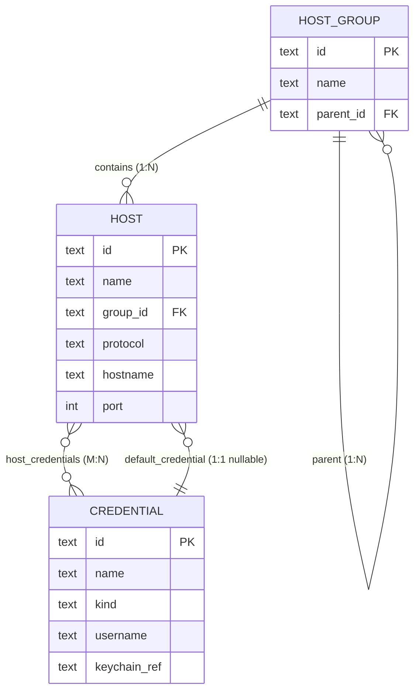

# Data Model — RemoteHub

## Overview

Локальное хранилище приложения. Делится на две части:

- **SQLite** — структурированные данные: хосты, группы, credentials-метаданные, настройки. Один файл базы данных в platform-specific app-data директории.
- **OS keychain** — секреты: пароли, приватные ключи, passphrases. Доступ через `keyring-rs`.

База — append-mostly, с редкими update'ами (правка хоста). Нагрузка минимальная (сотни-тысячи строк суммарно). Производительность не критична; важнее простота схемы и безопасность.

## Storage location

Путь к файлу БД — platform-specific. Базовая директория:

- Windows: `%APPDATA%\RemoteHub\`
- macOS: `~/Library/Application Support/RemoteHub/`
- Linux: `$XDG_DATA_HOME/remotehub/` (или `~/.local/share/remotehub/`)

Файлы:
- `remotehub.db` — SQLite.
- `known_hosts` — SSH known_hosts в OpenSSH-совместимом формате.
- `rdp_known_certs.json` — RDP cert trust store (см. ниже).
- `logs/` — директория с trace-логами.

При первом запуске директория создаётся, если её нет.

## Entities

### Host

Целевой сервер/рабочая станция для подключения.

```rust
// rh-core/src/types.rs (фрагмент)

#[derive(Debug, Clone, Serialize, Deserialize)]
pub struct Host {
    pub id: HostId,                                       // ULID
    pub name: String,                                     // canonical sort/search key (= display_name‖hostname)
    pub display_name: Option<String>,                    // explicit user label; null = show hostname (Stage 1.8)
    pub group_id: Option<GroupId>,                        // null = root
    pub protocol: Protocol,                               // ssh | rdp
    pub hostname: String,                                 // DNS name or IP
    pub port: u16,                                        // 22 (SSH) / 3389 (RDP) по умолчанию
    pub tags: Vec<String>,                                // serialized as JSON array
    pub color: Option<String>,                            // hex "#RRGGBB" или null
    pub notes: Option<String>,                            // free-form markdown
    pub startup_command: Option<String>,                 // SSH: command run on connect (Stage 1.8; consumed in Stage 2)
    pub env_vars: Vec<EnvVar>,                            // {key,value} pairs, JSON array (Stage 1.8)
    pub detected_os: Option<String>,                      // machine-set OS slug; null until Stage 2.2 detection
    pub default_credential_id: Option<CredentialId>,
    pub created_at: chrono::DateTime<chrono::Utc>,
    pub updated_at: chrono::DateTime<chrono::Utc>,
}

/// Stage 1.8. Order-preserving; serialized to `env_vars_json`.
#[derive(Debug, Clone, Serialize, Deserialize)]
pub struct EnvVar { pub key: String, pub value: String }
```

SQL:

```sql
CREATE TABLE hosts (
    id                      TEXT PRIMARY KEY NOT NULL,        -- ULID (26 chars)
    name                    TEXT NOT NULL,
    display_name            TEXT,                             -- Stage 1.8: explicit label; null = use hostname
    group_id                TEXT REFERENCES host_groups(id) ON DELETE SET NULL,
    protocol                TEXT NOT NULL CHECK (protocol IN ('ssh', 'rdp')),
    hostname                TEXT NOT NULL,
    port                    INTEGER NOT NULL CHECK (port > 0 AND port < 65536),
    tags_json               TEXT NOT NULL DEFAULT '[]',
    color                   TEXT,
    notes                   TEXT,
    startup_command         TEXT,                             -- Stage 1.8: SSH connect command
    env_vars_json           TEXT NOT NULL DEFAULT '[]',       -- Stage 1.8: JSON array of {key,value}
    detected_os             TEXT,                             -- Stage 1.8: machine-set OS slug (Stage 2.2 populates)
    default_credential_id   TEXT REFERENCES credentials(id) ON DELETE SET NULL,
    created_at              TEXT NOT NULL,                    -- ISO 8601 UTC
    updated_at              TEXT NOT NULL
);

CREATE INDEX idx_hosts_group ON hosts(group_id);
CREATE INDEX idx_hosts_protocol ON hosts(protocol);
CREATE INDEX idx_hosts_name ON hosts(name);
```

#### Поля — нюансы

- `id` — ULID (Universally Unique Lexicographically Sortable Identifier). 26 chars, монотонно растущий по времени → удобен для сортировки и не выдаёт информацию о порядке создания, как auto-increment. Crate `ulid`.
- `tags_json` — JSON-массив строк. Поиск по тегам — через `LIKE '%"tag"%'` или JSON1 extension (`json_each`). На объёме до 10k хостов хватит без полноценного `host_tags` table.
- `color` — для UI; nullable. Регулярки на формат — в Rust-валидации, не в БД (CHECK constraint можно добавить позже без боли).
- `notes` — потенциально длинный. Без size-limit в схеме, но в UI ограничиваем 10000 символами.
- `display_name` (Stage 1.8) — явный лейбл. `name` остаётся канонической строкой для сортировки/поиска (= `display_name‖hostname`), а `display_name` хранит то, что пользователь ввёл в поле Label (null = не задан → UI показывает hostname). Заменил старую эвристику `name == hostname`. Бэкенд нормализует пустую строку в NULL.
- `startup_command` (Stage 1.8) — команда при подключении по SSH. В UI поле скрыто для RDP; на сохранении при protocol≠ssh пишется NULL. Потребитель — session actor Stage 2.
- `env_vars_json` (Stage 1.8) — JSON-массив `{key,value}` с сохранением порядка (как `tags_json`). Лимиты в Rust-валидации: ≤64 переменных, key ≤256, value ≤4096, ключи непустые и уникальные.
- `detected_os` (Stage 1.8) — slug ОС, выставляется автоматически после коннекта (Stage 2.2). На create не принимается; пишется через обычный `host_update`. Драйвит иконку хоста в сайдбаре (2.2).

### HostGroup

Папка для группировки хостов. Иерархическая (поддерживает вложенность).

```rust
#[derive(Debug, Clone, Serialize, Deserialize)]
pub struct HostGroup {
    pub id: GroupId,
    pub name: String,
    pub parent_id: Option<GroupId>,
    pub created_at: chrono::DateTime<chrono::Utc>,
}
```

```sql
CREATE TABLE host_groups (
    id          TEXT PRIMARY KEY NOT NULL,
    name        TEXT NOT NULL,
    parent_id   TEXT REFERENCES host_groups(id) ON DELETE CASCADE,
    created_at  TEXT NOT NULL,

    UNIQUE (parent_id, name)              -- одно имя в рамках одного родителя
);

CREATE INDEX idx_host_groups_parent ON host_groups(parent_id);
```

`ON DELETE CASCADE` — удаление группы каскадно удаляет подгруппы. Хосты в этих группах теряют group_id (через `ON DELETE SET NULL` в hosts), переезжают в root.

Цикл-detection (нельзя сделать группу A родителем группы B, если B уже предок A) — в Rust-валидации, не в БД.

### Credential

Метаданные credential'а. Сам секрет — в keychain.

```rust
#[derive(Debug, Clone, Serialize, Deserialize)]
pub struct Credential {
    pub id: CredentialId,
    pub name: String,                       // "prod-root", "personal-key", etc.
    pub kind: CredentialKind,
    pub username: String,                   // empty для kind=SshKeyAgent
    pub keychain_ref: KeychainRef,          // "remotehub.<credential_id>"
    pub created_at: chrono::DateTime<chrono::Utc>,
    pub updated_at: chrono::DateTime<chrono::Utc>,
}

#[derive(Debug, Clone, Copy, Serialize, Deserialize, PartialEq, Eq)]
#[serde(rename_all = "snake_case")]
pub enum CredentialKind {
    Password,         // plain password (SSH password auth, RDP password)
    SshKey,           // PEM-encoded private key (с опциональной passphrase)
    SshKeyAgent,      // referenced from SSH agent (no secret in keychain)
}
```

```sql
CREATE TABLE credentials (
    id              TEXT PRIMARY KEY NOT NULL,
    name            TEXT NOT NULL,
    kind            TEXT NOT NULL CHECK (kind IN ('password', 'ssh_key', 'ssh_key_agent')),
    username        TEXT NOT NULL DEFAULT '',
    keychain_ref    TEXT NOT NULL,
    created_at      TEXT NOT NULL,
    updated_at      TEXT NOT NULL,

    UNIQUE (name)                                   -- имена credentials уникальны
);

CREATE INDEX idx_credentials_kind ON credentials(kind);
```

#### Keychain ref

`keychain_ref` — это служебная строка, идентифицирующая запись в OS keychain. Формат:

```
remotehub.<credential_id>
```

Например: `remotehub.01HXYZ123...`.

Сервис в keychain (тот же `service` параметр для `keyring-rs`) — фиксированный: `RemoteHub`. `username` (account) в keychain = `keychain_ref` (НЕ путать с username для SSH-подключения, который хранится в БД).

Это разделение даёт три свойства:
1. Один и тот же SSH-username может фигурировать в множестве credentials без коллизий в keychain.
2. Удаление credential → удаление одной строго определённой записи в keychain.
3. Внешний осмотр keychain показывает `RemoteHub` как единственный сервис со всеми ключами — легко audit'ить.

#### Содержимое в keychain

| kind | что хранится |
|---|---|
| `password` | UTF-8 байты пароля |
| `ssh_key` | PEM-encoded private key (со всем headers/footers). Если ключ зашифрован — passphrase **там же**, отдельным entry'ём `remotehub.<credential_id>.passphrase`. |
| `ssh_key_agent` | ничего. Запись в keychain не создаётся; `keychain_ref` остаётся в БД для consistency, но `reveal()` для такого credential возвращает специальный sentinel вместо чтения keychain. |

### HostCredential (M:N)

Связь host'а и credential'ов. Один host может иметь несколько credentials (например, root-пароль + dev-ключ), один credential может использоваться многими host'ами (общий ключ для парка серверов).

```sql
CREATE TABLE host_credentials (
    host_id         TEXT NOT NULL REFERENCES hosts(id) ON DELETE CASCADE,
    credential_id   TEXT NOT NULL REFERENCES credentials(id) ON DELETE CASCADE,
    is_default      INTEGER NOT NULL DEFAULT 0,        -- boolean: 0 или 1

    PRIMARY KEY (host_id, credential_id)
);

CREATE INDEX idx_host_credentials_credential ON host_credentials(credential_id);
```

Note: `hosts.default_credential_id` дублирует флаг `is_default` в этой таблице. Это сознательная денормализация — UI часто читает «дефолтный cred для host'а» одним джойн-free запросом. Поддержание consistency — ответственность storage layer (в одной транзакции).

### Settings

Ключ-значение для пользовательских настроек.

```sql
CREATE TABLE settings (
    key     TEXT PRIMARY KEY NOT NULL,
    value   TEXT NOT NULL                              -- JSON-encoded
);
```

Ключи и schema значений — фиксированы в Rust-коде, не в БД. Перечень в MVP:

| key | value schema | default |
|---|---|---|
| `theme` | `"light" \| "dark" \| "system"` | `"system"` |
| `terminal.font_family` | string | platform-specific monospace |
| `terminal.font_size` | number | `14` |
| `terminal.color_scheme` | `"default" \| "solarized-dark" \| "solarized-light" \| "dracula" \| "nord"` | `"default"` |
| `terminal.cursor_style` | `"block" \| "underline" \| "bar"` | `"block"` |
| `terminal.scrollback` | number | `10000` |
| `rdp.default_resolution` | `[width: number, height: number] \| "fit"` | `"fit"` |
| `app.confirm_close_session` | boolean | `true` |
| `app.startup_screen` | `"home" \| "last_hosts"` | `"home"` |

Чтение settings — bulk-loaded на старте, cached в памяти. Запись — write-through.

### KnownHosts (SSH)

Файл `known_hosts` — отдельно от SQLite, в OpenSSH-совместимом формате:

```
hostname[,ip] keytype base64-key
```

Это даёт совместимость с системным `ssh` (можно при необходимости поделиться). Парсинг и запись — через russh-keys или ручной парсер.

В БД храним один служебный setting: `ssh.known_hosts_strict` (boolean, default `true`) — если выключено, mismatch выдаст warning, а не блок.

### RdpKnownCerts

RDP host-cert pinning. Аналог known_hosts для RDP.

```json
[
    {
        "hostname": "server01.example.com",
        "port": 3389,
        "fingerprint_sha256": "AB:CD:EF:...",
        "subject": "CN=server01.example.com",
        "trusted_at": "2025-05-27T10:00:00Z"
    }
]
```

Файл `rdp_known_certs.json`. Простой JSON, потому что строк будет мало (пользователь подключается к десяткам RDP-хостов, не к тысячам).

## Relationships



## Schema versioning and migrations

Альфа-режим: на каждом bump'е версии схемы — **drop + recreate**, никаких up/down миграций.

В БД одна служебная таблица:

```sql
CREATE TABLE schema_meta (
    key     TEXT PRIMARY KEY NOT NULL,
    value   TEXT NOT NULL
);
INSERT INTO schema_meta (key, value) VALUES ('version', '1');
```

На старте приложение:

1. Открывает БД.
2. Читает `schema_meta.version`. Если файла/таблицы нет — версия `0`.
3. Если версия не совпадает с ожидаемой в коде (`CURRENT_SCHEMA_VERSION = 1`) — показывает диалог: «БД устарела/из будущего, данные будут стёрты при апгрейде. Продолжить / экспортировать сначала / выйти».
4. На «Продолжить» — `DROP` всех таблиц, recreate, версия выставляется в `CURRENT_SCHEMA_VERSION`.

Это политика для альфы. Когда выпустим beta — заменим на нормальные up-миграции (`refinery` или ручной runner).

## Indexes

| Table | Index | Rationale |
|---|---|---|
| `hosts` | `(group_id)` | список хостов в группе |
| `hosts` | `(protocol)` | фильтр по SSH/RDP в UI |
| `hosts` | `(name)` | сортировка по имени, поиск |
| `host_groups` | `(parent_id)` | дерево групп |
| `credentials` | `(kind)` | фильтр credentials по типу при выборе |
| `host_credentials` | `(credential_id)` | «какие хосты используют этот credential» |

PRIMARY KEY на ID — автоматически. UNIQUE на `(parent_id, name)` в `host_groups` и на `name` в `credentials` — тоже создают индексы.

JSON-поля (`tags_json`, settings values) **не** индексируем в MVP — на объёме данных это не нужно.

## Migrations

Не делаем в альфе (см. выше). Когда понадобится — переходим на `refinery` (миграции — отдельные SQL-файлы с порядковым префиксом, `embed_migrations!` в коде).

## Open Questions

1. **Шифрование SQLite через SQLCipher?** Решение в `system-overview.md`: нет в MVP. БД содержит только метаданные, секреты в keychain. Если пользователь хочет шифрование на уровне диска — это OS-level задача (BitLocker, FileVault, dm-crypt).
2. **Soft delete для hosts/credentials?** Сейчас — hard delete с CASCADE. Soft delete (`deleted_at`) удобнее для случайного «удалил не то», но усложняет все queries. **Предложение**: НЕ в MVP. Добавим, если будет реальная пользовательская жалоба.
3. **Audit log (когда какой host был открыт)?** В MVP не пишем — данные деликатные (хранение истории доступа — само по себе security-concern, спросит ли пользователь это). Можно добавить как opt-in setting позже.

## Assumptions

- Один пользователь на устройство (нет multi-tenancy внутри приложения).
- Объёмы: до 10 000 хостов, до 1 000 credentials, до 100 групп. Всё помещается в RAM, queries — быстрые без оптимизации.
- ULID для всех ID. Никаких автоинкрементов.
- Все timestamp'ы — UTC, ISO 8601 строкой. SQLite не имеет нативного DateTime; sqlx при `chrono` feature умеет в обе стороны.

## Related specs

- `system-overview.md` — общий контекст.
- `tauri-api.md` — какие команды и как мапятся на этот data model.
