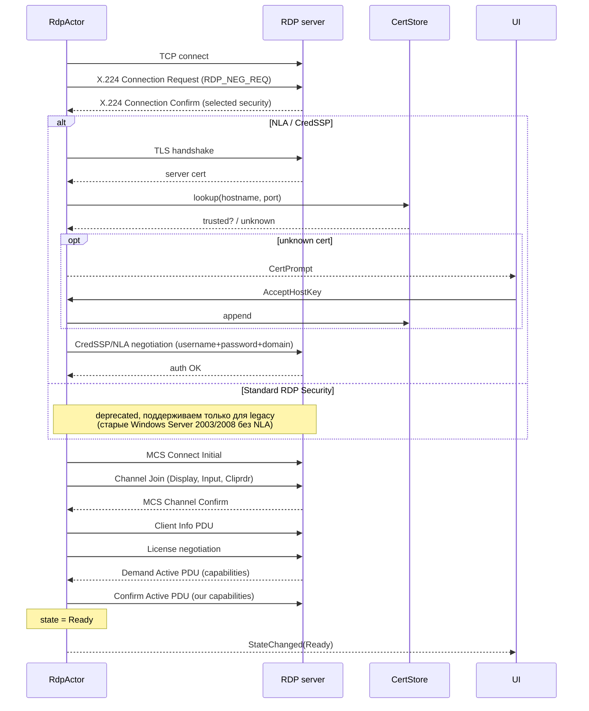
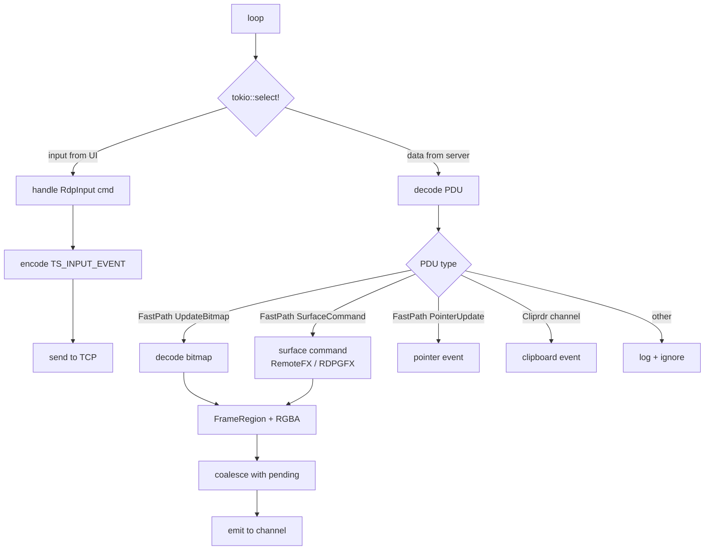

# RDP Session — RemoteHub

## Overview

Детали реализации RDP-сессии: интеграция с IronRDP, аутентификация (NLA / standard RDP security), декодирование графики, обработка ввода, clipboard. Общая actor-модель и lifecycle — в `session-protocol.md`.

Эта спека — самая «горячая» в проекте. RDP — сложный бинарный stateful-протокол, и большинство известных подводных камней — здесь.

## Crate: rh-rdp

Публичный API:

```rust
// rh-rdp/src/lib.rs

pub async fn spawn_session(params: RdpSpawnParams) -> SessionHandle;

pub struct RdpSpawnParams {
    pub id: SessionId,
    pub host: Host,
    pub credential: RevealedRdpCredential,
    pub options: RdpOpenOptions,
    pub cert_store: Arc<dyn RdpCertStore>,
    pub event_channel: tauri::ipc::Channel<RdpSessionEvent>,
}

pub struct RdpOpenOptions {
    pub width: u16,
    pub height: u16,
    pub color_depth: ColorDepth,             // 16 | 24 | 32
    pub keyboard_layout: KeyboardLayout,     // strongly typed
    pub enable_clipboard: bool,              // default true
}

pub enum RevealedRdpCredential {
    Password {
        username: String,
        domain: Option<String>,
        password: RevealedSecret,
    },
    // SmartCard, Cert-based — после MVP
}
```

## IronRDP integration

IronRDP — workspace из нескольких crate'ов. Мы используем:

```toml
ironrdp = { version = "<latest>", features = ["connector", "session"] }
ironrdp-blocking = "<latest>"  # synchronous helpers
ironrdp-async = "<latest>"     # async wrappers
ironrdp-graphics = "<latest>"  # codec implementations (RemoteFX, RLE, etc.)
ironrdp-rdpsnd = "<latest>"    # audio — НЕ в MVP, для будущего
ironrdp-cliprdr = "<latest>"   # clipboard channel
ironrdp-input = "<latest>"     # input event types
```

Конкретные версии и точные имена crate'ов в workspace — фиксируются на момент `rust-dev` старта Stage RDP (см. plan'ы), потому что IronRDP активно эволюционирует и наши `<latest>` в спеке должны быть проверены реальностью.

В качестве референс-имплементации **обязательно** изучить `ironrdp-client` (full-fledged async RDP client из workspace IronRDP). Это наш blueprint.

## Focus / modifier-key synchronization

Classic RDP bug: модификаторы (Ctrl/Alt/Shift/Win) «залипают» на удалённом рабочем столе после потери фокуса RDP-окна. Сценарий: пользователь жмёт Ctrl+что-то в RDP, переключается на локальное приложение (Alt+Tab / Win+D / клик в другое окно), физически отпускает Ctrl **вне** RDP-окна. RDP-клиент не получает `KeyUp` для Ctrl и не информирует сервер. Сервер продолжает считать Ctrl нажатым.

Это особенно болезненно при:
- Переключении между мониторами в multi-monitor сетапе.
- Maximize/fullscreen toggle (окно теряет/получает фокус как часть transition).
- Win+L и других глобальных hotkey'ах OS.

### Required behaviour (must be in RDP foundation stage)

Actor MUST handle **focus loss** и **focus gain** events from the WebView side и transparently синхронизировать состояние модификаторов с сервером:

1. **On focus loss** (UI обнаруживает `blur` event на RDP canvas'е): UI шлёт actor'у `SessionCommand::RdpInput(RdpInputEvent::ReleaseAllModifiers)`. Actor отправляет серверу `KeyUp` для всех модификаторов, которые сервер сейчас считает зажатыми (Ctrl/Alt/Shift/Win, левые + правые версии).

2. **On focus gain** (`focus` event): UI шлёт `RdpInputEvent::SyncModifiers { ctrl, alt, shift, meta, caps_lock, num_lock, scroll_lock }` с актуальным состоянием physical клавиш (получено через `KeyboardEvent.getModifierState()` в браузерном API). Actor вычисляет diff с тем, что сервер «думает», и посылает соответствующие `KeyDown`/`KeyUp`.

3. **Internal modifier state tracking**: actor держит in-memory `ModifierState` со всеми модификаторами, обновляет на каждом `Key` event. Это позволяет вычислить diff в шаге 2 и предотвращает posting `KeyUp` для того, что уже отжато.

### Lock keys (CapsLock/NumLock/ScrollLock)

Для lock-клавиш стандартный RDP PDU `TS_SYNC_EVENT` существует и его нужно использовать (отдельно от описанного выше — это другая семантика). Но из практики ironrdp / FreeRDP знают, что серверы реагируют на TS_SYNC непредсказуемо; полагаться **только** на него опасно. Pragmatic подход: посылать TS_SYNC при connect + при каждом focus gain, **плюс** дополнительно эмулировать `KeyDown+KeyUp` для конкретных lock-клавиш, состояние которых разошлось.

### Updated event types

Замени current `SyncMods { caps_lock, num_lock, scroll_lock }` (в `tauri-api.md`) на:

```rust
#[derive(Debug, Deserialize)]
#[serde(tag = "kind", rename_all = "snake_case")]
pub enum RdpInputEvent {
    // ... existing variants ...

    /// Sent by UI when the RDP canvas gains focus. Carries the full
    /// state of physical modifier keys at the moment of focus. Actor
    /// diffs against its internal state and emits the necessary
    /// KeyDown/KeyUp events to bring the server in sync.
    SyncModifiers {
        ctrl: bool,
        alt: bool,
        shift: bool,
        meta: bool,         // Win key on Windows, Cmd on macOS
        caps_lock: bool,
        num_lock: bool,
        scroll_lock: bool,
    },

    /// Sent by UI on focus loss. Actor releases every modifier the
    /// server believes is held. No diff — just blanket KeyUp.
    ReleaseAllModifiers,
}
```

### Verification (manual test cases for Stage 4 acceptance)

1. Подключиться к RDP. Нажать и удерживать Ctrl. Alt+Tab. Отпустить Ctrl. Вернуться в RDP. **Кликнуть** — клик должен быть обычным, не Ctrl+клик.
2. Открыть Notepad на сервере. Нажать Ctrl+A (выделить всё). Alt+Tab. Вернуться. **Стрелка вправо** должна сдвинуть курсор на 1 символ (не на слово, как было бы при залипшем Ctrl).
3. Maximize/restore RDP-окно во время удержания Shift. После — обычный клик должен быть НЕ Shift+клик.

Эти три кейса покрывают 95% реальных жалоб на «залипание модификаторов» в RDP.

## Connection sequence



Львиную долю этого делает `ironrdp-connector` под капотом. Наша задача — подсунуть ему credentials, обработать TLS, и принять на выход `ConnectionResult`, из которого создаётся `ActiveStage`.

## State after handshake — graphics decoding loop

После `Ready` — main loop:



Все типы PDU обрабатываются IronRDP при помощи state machine `ironrdp::session::ActiveStage`. Наш actor вызывает `stage.process(received_bytes)` и получает back список `ActiveStageOutput` действий: либо отослать что-то обратно, либо передать наверх как event.

### Decoded frame format

После декодирования (любого codec'а — RLE, RDP 6.0 bitmap, RemoteFX) на выходе у нас:

```rust
pub struct DecodedFrame {
    pub region: FrameRegion,
    pub format: PixelFormat,         // BGRA8 / RGBA8 — выбираем то, что Canvas API ест без конверсии
    pub pixels: Vec<u8>,             // little-endian, row-major, без padding
}

pub enum PixelFormat {
    Bgra8,
    Rgba8,
}
```

UI получает `RdpSessionEvent::Frame { region, format, data }`. На стороне UI — кладёт в `ImageData` и `putImageData()` в нужный rect canvas'а.

### Frame coalescing

См. `session-protocol.md` — общая идея. Конкретика для RDP:

1. Actor держит `pending_frame: Option<DecodedFrame>`.
2. Когда декодирует новый frame и `pending_frame.is_none()` — отправляет в Channel, переход в "in flight" (запоминаем bounding box).
3. Если `pending_frame.is_some()` — мерджим (бьёмся через bounding box и memcpy в новый buffer).
4. Когда видим, что Channel принял (внутренний counter / capacity check) — flush'нем `pending_frame`.

Tauri 2 Channel API не выставляет ack'и, поэтому "принял" мы аппроксимируем: считаем кол-во `send` за окно времени (например, 16 мс ≈ 60 FPS) и не отправляем чаще. Merge'ы за это время накапливаются.

**Конкретные числа** (rate limit, окно, merge-strategy) — это performance-tuning, который делается на реальном железе. В MVP — простая стратегия: «не больше одного in-flight frame'а; ждём 16 мс между отправками».

## Input mapping

UI шлёт `RdpInputEvent` (см. `tauri-api.md`). Actor мапит на `ironrdp-input`:

| UI event | IronRDP / TS_INPUT_EVENT |
|---|---|
| `MouseMove { x, y }` | `MouseEvent::Move { x, y }` |
| `MouseButton { button: Left, pressed: true, x, y }` | `MouseEvent::Button { btn: Left, action: Press }` |
| `MouseWheel { delta, x, y }` | `MouseEvent::Wheel { delta }` |
| `Key { scancode, pressed, extended }` | `KeyboardEvent::ScanCode { code, action }` |

### Keyboard scancode'ы

Сложность: UI получает от браузера `KeyboardEvent.code` (например, "KeyA", "ArrowUp"). RDP хочет PS/2 scancode'ы. Маппинг — `ironrdp-input` имеет таблицы.

UI **не** должен мапить — он шлёт `code` строкой. Mapping `code → scancode` — в `rh-rdp` (одной плоской матрицей, генеренной либо хардкоженной).

Это решение — для type-safety и единого источника правды.

```rust
pub enum BrowserKeyCode(pub String);    // "KeyA", "Enter", ...

impl RdpActor {
    fn map_browser_key(&self, code: &str) -> Option<u16> { ... }
}
```

### Layout-зависимость

Для символьных клавиш (что напечатать `<` — Shift+, или AltGr+ — зависит от layout'а на клиенте) — мы шлём scancode'ы, а **сервер** применяет свой layout. Это даёт ожидаемое поведение: на сервере с en-US — "<" пишется Shift+","; на ru-RU — другой scancode.

`keyboard_layout` опция передаётся в Client Info PDU, чтобы сервер знал ожидаемый layout (это hint, не обязательство).

## Clipboard

Bidirectional через `cliprdr` virtual channel:

- **UI копирует** → emit'ит в Rust через `SessionCommand::ClipboardOut { mime: "text/plain", data }` → actor отправляет в cliprdr channel.
- **Server копирует** → cliprdr channel → actor парсит → `RdpSessionEvent::Clipboard { mime, data }` → UI кладёт в системный clipboard (через Tauri clipboard API).

MVP — только plain text. Image / files — после MVP.

## Cert verification

```rust
#[async_trait]
pub trait RdpCertStore: Send + Sync {
    async fn lookup(&self, hostname: &str, port: u16) -> Result<Option<TrustedCert>, CertStoreError>;
    async fn append(&self, hostname: &str, port: u16, cert: TrustedCert) -> Result<(), CertStoreError>;
}

pub struct TrustedCert {
    pub fingerprint_sha256: String,
    pub subject: String,
    pub trusted_at: chrono::DateTime<chrono::Utc>,
}
```

Реализация — поверх `rdp_known_certs.json` (см. data-model). Аналог known_hosts по логике.

Сначала пробуем стандартную проверку chain'а через rustls + system roots. Если cert валиден по chain'у — accept без prompt'а. Если invalid (self-signed, expired, untrusted CA) — fingerprint match по local store, иначе UI prompt.

## Disconnection

- **User**: `SessionCommand::Shutdown` → actor шлёт MCS Disconnect PDU → закрывает TCP.
- **Server**: получаем Server Set Error Info / disconnection PDU → парсим reason → emit `Closed { ServerDisconnected }`.
- **Idle timeout**: настраивается на сервере, мы только реагируем.

## Performance considerations

MVP performance targets — в system-overview. Конкретные техники достижения:

- **Frame coalescing** (см. выше).
- **WebGL renderer** для canvas (`OffscreenCanvas` + `ImageBitmap`). Software 2D canvas-у `putImageData` ест CPU на больших frame'ах. Но это UI-side оптимизация, документируется в дизайн-спеке.
- **Pixel format**: договариваемся с сервером на 32bpp BGRA (или RGBA — зависит от того, что natively жрёт `ImageData` без свопа). Меньше swap'ов = быстрее.
- **Codecs**: для MVP — bitmap update + RLE compression (стандартный legacy path; работает везде). RemoteFX (AVC444 в современных Win Server) — после MVP, потому что декодер ironrdp-graphics для AVC444 ещё в активной разработке и может не быть готов на наш timeline.

## Error handling

```rust
#[derive(Debug, thiserror::Error)]
pub enum RdpError {
    #[error("network error: {0}")]
    Network(#[from] std::io::Error),

    #[error("TLS error: {0}")]
    Tls(String),

    #[error("connector error: {0}")]
    Connector(String),                       // обёртка над ironrdp-connector errors

    #[error("auth failed")]
    AuthFailed,

    #[error("cert untrusted")]
    CertUntrusted,

    #[error("cert rejected by user")]
    CertRejected,

    #[error("active stage error: {0}")]
    ActiveStage(String),

    #[error("PDU decode error: {0}")]
    Decode(String),

    #[error("graphics decode error: {0}")]
    Graphics(String),
}
```

Маппинг в `CloseReason` аналогично SSH (см. `session-protocol.md`).

## Open Questions

1. **Frame transport efficiency.** Tauri Channel передаёт `Vec<u8>` — это значит копия в JS-heap. На 1080p@24bpp 60FPS это ~300 MB/s, что неприемлемо. **Опции**:
   - **(a)** Tauri custom protocol (`stream://`) — frame отдаётся как HTTP response. Браузер декодит в `ImageBitmap`. Не требует JSON.
   - **(b)** WebSocket localhost (мы знаем PORT) — chunked binary, низкоуровневая.
   - **(c)** SharedArrayBuffer (если Tauri даёт включить) — zero-copy.
   - **Предложение**: реализуем (a) — custom protocol — как первую итерацию. (c) для второй. **Реальный choice** делается на этапе RDP Foundation (Stage 4 в плане): первый день — спайк всех трёх, бенчмарк, фиксируем.
2. **Audio (`rdpsnd`)?** Не в MVP. Полезно (alerts с сервера, видео с YouTube через RDP), но удлиняет timeline вдвое.
3. **Multi-monitor?** Не в MVP. RDP это поддерживает; UI canvas — нет.
4. **Smart-card auth?** Не в MVP.
5. **Реальная зрелость IronRDP клиента на нашем use-case.** До начала RDP-стадии — пользователь / rust-dev должен реально запустить `ironrdp-client` против тестового RDP-сервера (Windows VM) и убедиться, что happy-path работает. Если не работает — meeting и пересмотр плана.

## Assumptions

- Серверы — Windows Server 2012 R2 или новее, или xrdp на Linux (для тестов).
- RDP версия 8.1 или новее (это значит NLA, Fast-Path updates, базовые codec'и).
- Целевое разрешение MVP — 1920×1080. Меньшие — работают тривиально. Большие (4K, multi-mon) — после MVP.
- TLS обязателен. Без TLS не подключаемся (это означает поддержку только Windows Server 2008+, что нам подходит).
