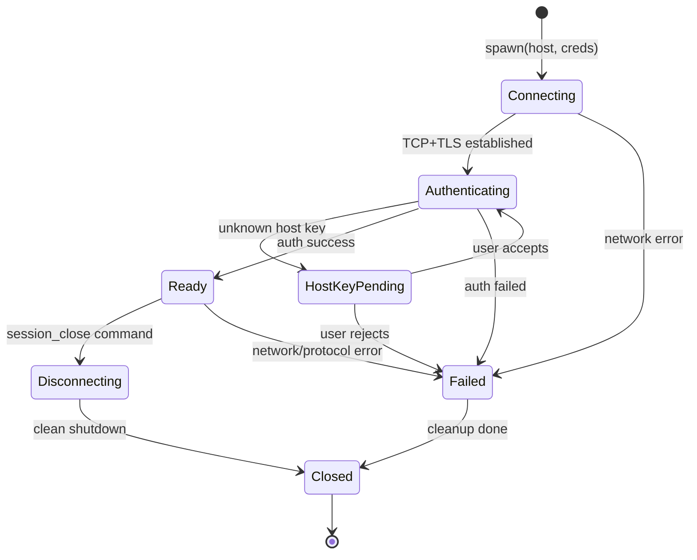
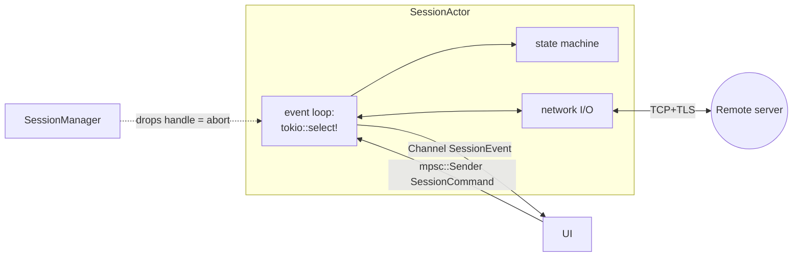
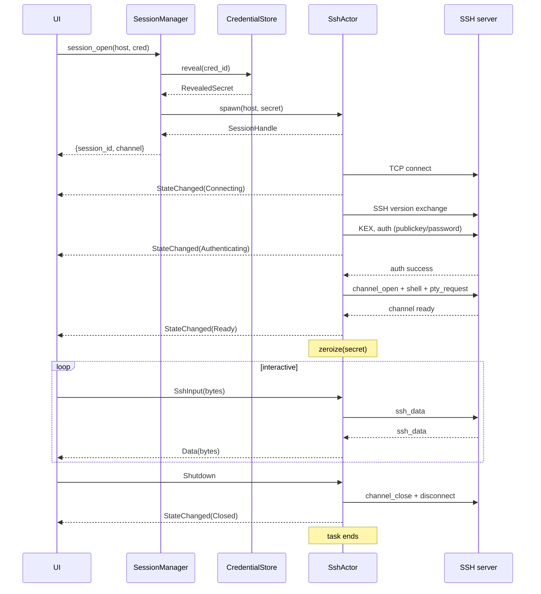
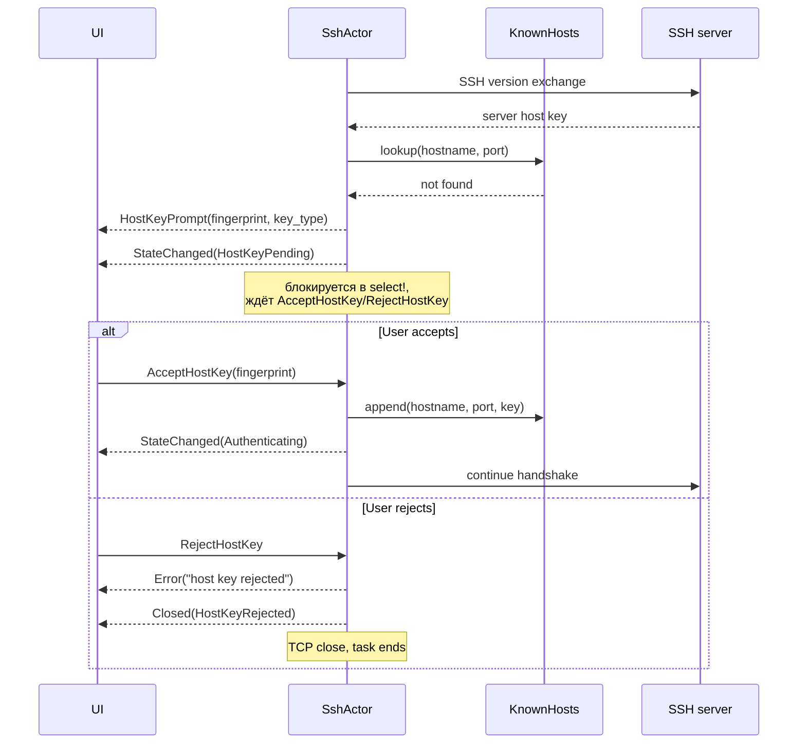
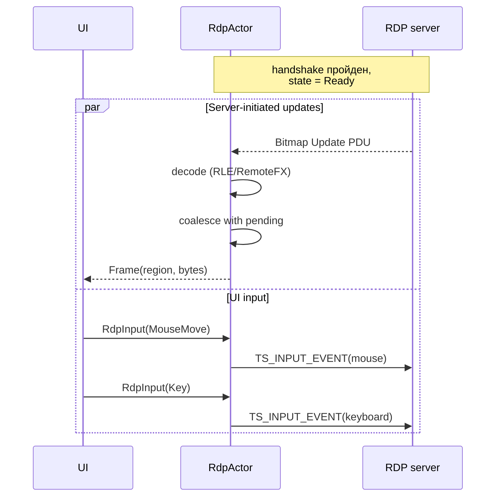

# Session Protocol — RemoteHub

## Overview

Каждая открытая удалённая сессия (SSH или RDP) — это long-running Tokio task, которая:

- Владеет сетевым соединением.
- Принимает команды от UI через `mpsc`-канал.
- Шлёт события в UI через `Channel<T>` (Tauri 2).
- Завершается либо по запросу UI (`session_close`), либо по сетевой/протокольной ошибке.

Эта спека описывает actor-модель, message types, lifecycle и error handling, которые **одинаковы** для SSH и RDP. Протокол-специфичные нюансы (что именно посылается в сеть, как обрабатываются конкретные PDU) — в `ssh-session.md` и `rdp-session.md`.

## Connection lifecycle



Состояния — sequential; нет «retry авто-reconnect» в MVP (это сразу делает state machine сложнее, и пользователь обычно сам решает, когда ткнуть retry).

### State semantics

| State | Что происходит |
|---|---|
| `Connecting` | TCP connect, TLS handshake (для RDP с NLA — также pre-auth) |
| `Authenticating` | Протокольный auth (SSH userauth / RDP NLA credential exchange) |
| `HostKeyPending` | Получен host key, не в `known_hosts`. Ждём решения пользователя. |
| `Ready` | Сессия открыта, можно слать input / получать output. |
| `Disconnecting` | Идёт graceful shutdown (close channel в SSH, disconnect PDU в RDP). |
| `Closed` | Терминальное. Actor завершается. UI должен убрать таб. |
| `Failed` | Терминальное со специфической причиной. Переходит в `Closed` сразу после очистки. |

## Actor architecture



### Handle (что хранит SessionManager)

```rust
// rh-core/src/session.rs

pub struct SessionHandle {
    pub id: SessionId,
    pub host_id: HostId,
    pub protocol: Protocol,
    pub state: Arc<RwLock<SessionState>>,
    pub tx_cmd: mpsc::Sender<SessionCommand>,
    pub opened_at: chrono::DateTime<chrono::Utc>,

    /// Drop отправляет shutdown-сигнал и await'ит graceful exit с таймаутом.
    /// После таймаута — abort.
    abort: tokio::task::AbortHandle,
}
```

`SessionHandle` — это «remote control» для actor'а. SessionManager хранит `HashMap<SessionId, SessionHandle>` под `Mutex`. Удаление из мапы → drop → graceful shutdown.

### Actor task signature

Концептуально:

```rust
// rh-ssh/src/actor.rs (псевдокод)

pub async fn spawn_ssh_session(
    id: SessionId,
    host: Host,
    secret: RevealedSecret,
    options: SshOpenOptions,
    rx_cmd: mpsc::Receiver<SessionCommand>,
    event_channel: tauri::ipc::Channel<SshSessionEvent>,
    known_hosts: Arc<dyn KnownHostsStore>,
) -> SessionHandle {
    let (tx_cmd, rx_cmd) = mpsc::channel(64);
    let state = Arc::new(RwLock::new(SessionState::Connecting));
    let state_for_task = state.clone();

    let join = tokio::spawn(async move {
        run_ssh_actor(id, host, secret, options, rx_cmd, event_channel, known_hosts, state_for_task).await
    });

    SessionHandle { id, ..., abort: join.abort_handle() }
}
```

Аналогично для RDP.

Внутри `run_ssh_actor` — `tokio::select!` по:
1. `rx_cmd.recv()` — команды от UI
2. данные с сети (russh stream)
3. tick для keepalive (если включено)
4. `shutdown_rx` — внутренний сигнал на выход

### Why actor model

Альтернатива — shared state с мьютексами и сетевые операции через коннекшен-pool. Для SSH/RDP это плохо ложится: каждое подключение — это stateful long-lived stream, который физически принадлежит одной задаче. Actor-pattern даёт:

- **Изоляция**: panic в одной сессии не валит остальные.
- **Простой shutdown**: drop handle → abort → cleanup в `Drop` имплементациях.
- **Никаких lock contention'ов**: state читается только из event loop'а, наружу видится через `Arc<RwLock>` для read-only queries (`session_list`).

## Message format

### Commands (UI → Actor)

Командный enum общий, но протокол-специфичные варианты — в отдельных подtypes для type-safety.

```rust
// rh-core/src/session.rs

#[derive(Debug)]
pub enum SessionCommand {
    /// Только для SSH.
    SshInput(Bytes),

    /// Только для RDP.
    RdpInput(RdpInputEvent),

    /// SSH: resize PTY. RDP: resize remote display.
    Resize { width: u16, height: u16 },

    /// Подтверждение TOFU host key (SSH или RDP cert).
    AcceptHostKey { fingerprint: String },

    /// Отказ от TOFU host key.
    RejectHostKey,

    /// Передать в SSH/RDP clipboard data.
    ClipboardOut { mime: String, data: Bytes },

    /// Graceful shutdown.
    Shutdown,
}
```

Use `bytes::Bytes` (а не `Vec<u8>`) для zero-copy — для крупных paste'ов и потоков RDP-input это сэкономит аллокаций.

Отправка команды актёру: `handle.tx_cmd.send(SessionCommand::SshInput(bytes)).await`. Если канал переполнен (64 в буфере) — backpressure до получения слота. Реалистично 64 хватит на любой типовой ввод (даже paste 100 KB — это сотни сообщений по ~1 KB).

### Events (Actor → UI)

См. `tauri-api.md` секция Session events для конкретных variant'ов `SshSessionEvent` и `RdpSessionEvent`. Здесь — паттерн.

Все события несут `session_id` имплицитно (channel принадлежит одной сессии). Все события Serde-serializable. Бинарные payload'ы (PTY-output, RDP-frame) идут как `Vec<u8>` — Tauri 2 Channel умеет передавать их без JSON-копирования при использовании `InvokeResponseBody::Raw`.

### Backpressure strategy

UI обычно медленнее, чем актор может производить события (особенно RDP с full-screen updates). Channel ёмкость не безграничная. Стратегия:

- **SSH**: `Channel<SshSessionEvent>` — bounded 256. На overflow — drop oldest, log warning. PTY output устойчив к потерям только если потеря согласована — но в практике 256-event buffer вмещает секунды вывода, и UI не отстаёт. Если отстаёт — пользователь видит «рывки», но не corrupted state (xterm.js просто проигрывает поступающее).
- **RDP**: иначе. Frame events идут с full-region tracking. Drop framе'а ведёт к visual artifact'у, который не самокорректируется. Стратегия: **coalescing** на уровне actor'а — если фрейм-событие ещё в очереди, новый фрейм мерджится в bounding box. Это делается до отправки в Channel, на стороне actor'а.

Подробности coalescing'а — в `rdp-session.md`.

## Sequence diagrams

### SSH session — happy path



Ключевые моменты:
- `RevealedSecret` явно `zeroize`-нится сразу после успешной аутентификации. Дальше актор не нуждается в нём.
- Если auth провалится — actor шлёт `AuthFailed` + завершается. Не делает retry.

### SSH session — TOFU host key prompt



Это единственный flow, где actor **синхронно** ждёт ответа от UI. Реализуется через select! на cmd-channel'е — actor продолжает быть отзывчивым к Shutdown'у.

### RDP session — frame loop



Frame coalescing: если в `Channel` есть необработанный `Frame` event, и приходит новый `Frame` с пересекающимся region'ом — мерджим в bounding box перед emit'ом. Если непересекающиеся — отправляем как есть.

## Error handling

Ошибки на уровне actor'а классифицируются:

| Класс | Примеры | Реакция |
|---|---|---|
| **Pre-auth network** | TCP refused, DNS fail, TLS handshake fail | Event `Error{message}` + `Closed{NetworkError}`. Actor завершается. |
| **Auth** | wrong password, bad key, MFA challenge (не поддержано) | Event `AuthFailed{method}` + `Closed{AuthFailed}`. |
| **Host key untrusted** | TOFU прерван пользователем, или mismatch | `Closed{HostKeyRejected}`. |
| **Mid-session network** | TCP reset, timeout | Event `Error{message}` + `Closed{NetworkError}`. UI таб показывает error + Retry. |
| **Server-initiated disconnect** | `exit shell` в SSH, idle timeout | Event `Closed{ServerDisconnected{reason}}`. |
| **Protocol violation** | malformed PDU | `Error` + `Closed{Crashed}`. Логируется с дампом. |
| **Panic** | bug в нашем коде | SessionManager ловит через `JoinHandle::await` → `JoinError::Panic`. Event `Closed{Crashed{message}}`. |

Никакого retry-логики на уровне actor'а. Retry = user action = новый `session_open`.

### Cleanup invariants

При завершении actor'а — ДОЛЖНЫ:
1. Закрыть TCP-сокет (`drop` handles this).
2. Zeroize все буферы с секретами (Drop on `Zeroizing<>` handles this).
3. Отправить финальное `Closed` event.
4. Не оставить spawned subtask'и (например, frame-decoder в отдельной task). Все subtask'и owned actor'ом и cancel'нутся при abort'е через `tokio::task::JoinSet`.

### SessionManager-level supervision

```rust
// rh-app/src/session/manager.rs (псевдокод)

impl SessionManager {
    pub async fn open_ssh(...) -> Result<SessionId, ApiError> {
        let join = tokio::spawn(run_ssh_actor(...));
        let handle = SessionHandle { id, abort: join.abort_handle(), ... };

        // Supervisor task: ждёт окончания actor'а и убирает из registry.
        let registry = self.registry.clone();
        let session_id = id.clone();
        tokio::spawn(async move {
            let result = join.await;
            registry.lock().await.remove(&session_id);
            if let Err(e) = result {
                if e.is_panic() {
                    tracing::error!(session_id = %session_id, "session actor panicked: {:?}", e);
                }
            }
        });

        self.registry.lock().await.insert(id.clone(), handle);
        Ok(id)
    }
}
```

Supervisor task ловит panic, лочит реестр на короткое время для удаления.

## Reconnection

В MVP — нет автоматического реконнекта. Это сознательный choice: реальный SSH-shell unrecoverable после disconnect'а (потерян PTY state), а RDP-reconnect требует server-side session persistence (которое настраивается separately на сервере).

Что **есть** в MVP:
- Кнопка «Reconnect» в табе с failed session. Создаёт новую `session_open` с теми же параметрами. Старая сессия в registry'е уже удалена.

Что будет **после MVP**:
- SSH connection multiplexing (один TCP, несколько channel'ов — для SFTP + shell на одном host'е).
- RDP session reconnect (RDP Session Reconnection feature) — отдельная итерация.

## Open Questions

1. **Channel ёмкость для SSH event-channel'а**: 256 — выбрано «на глаз». На практике может оказаться мало (massive ouput из `find /`) или много (idle сессия — 256 ивентов это >минуты буфера). **Предложение**: оставить 256 в MVP, добавить metric «events dropped» в логи; если будет hit'аться в реальном использовании — затюнить.
2. **Tauri 2 Channel — bi-directional?** На дату написания спеки docs говорят только про uni-directional Channel из Rust в UI. Если UI→Rust Channel доступен — `session_send_input` стоит перевести на него (zero-copy для paste'ов). Иначе — JSON-IPC с `Vec<u8>` (медленнее, но рабоче). **Проверить на этапе SSH foundation**.
3. **Keepalive**: SSH server-alive packet раз в N секунд. Включать ли по умолчанию? **Предложение**: да, 30s, конфигурируемо в settings. Для RDP — TS_KEEPALIVE PDU аналогично.

## Assumptions

- Один TCP-коннекшен на сессию. Нет multiplex'а (per-host SSH-coalescing на старте делать смысла мало).
- Все сессии живут в одном Tokio runtime'е. Нет блокирующих операций в actor'ах (если что-то requires blocking I/O — `tokio::task::spawn_blocking`).
- UI таб ↔ сессия — 1:1. Несколько табов на одну сессию (multi-view) — не поддерживается в MVP.

## Related specs

- `system-overview.md` — общий контекст.
- `tauri-api.md` — IPC-контракт.
- `ssh-session.md` — детали SSH-actor'а: russh-обёртка, PTY, channel-management.
- `rdp-session.md` — детали RDP-actor'а: IronRDP-обёртка, frame coalescing, input mapping.
