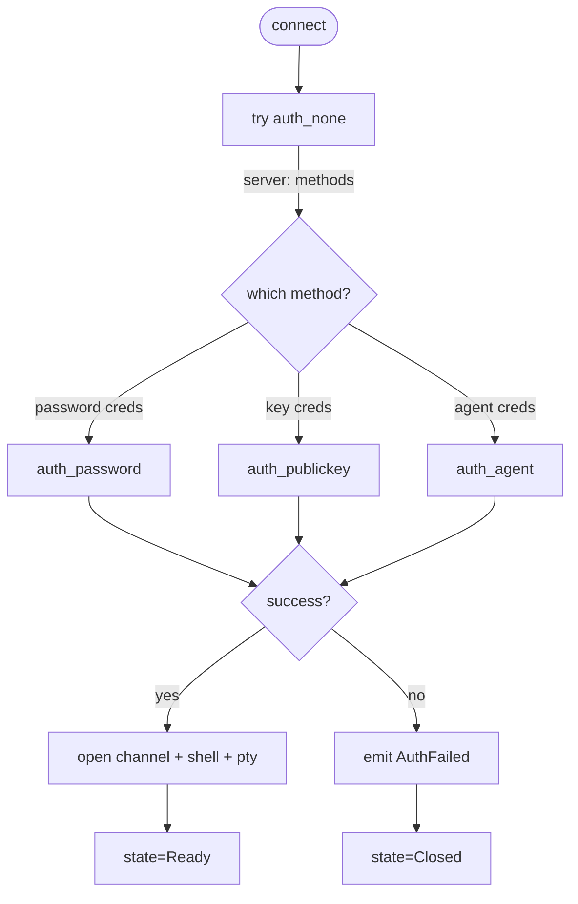

# SSH Session — RemoteHub

## Overview

Детали реализации SSH-сессии: интеграция с `russh`, аутентификация, PTY, обработка известных хостов. Общая actor-модель и lifecycle — в `session-protocol.md`. Эта спека добавляет SSH-специфику.

## Crate: rh-ssh

Публичный API:

```rust
// rh-ssh/src/lib.rs

pub async fn spawn_session(params: SshSpawnParams) -> SessionHandle;

pub struct SshSpawnParams {
    pub id: SessionId,
    pub host: Host,
    pub credential: RevealedCredential,
    pub options: SshOpenOptions,
    pub known_hosts: Arc<dyn KnownHostsStore>,
    pub event_channel: tauri::ipc::Channel<SshSessionEvent>,
    pub agent: Option<Arc<dyn SshAgent>>,           // None в MVP
}

pub struct SshOpenOptions {
    pub cols: u16,
    pub rows: u16,
    pub term: String,
    pub keepalive_interval: Option<Duration>,
}

pub enum RevealedCredential {
    Password { username: String, password: RevealedSecret },
    Key {
        username: String,
        private_key_pem: RevealedSecret,
        passphrase: Option<RevealedSecret>,
    },
    Agent { username: String },                     // not in MVP, reserved
}
```

`spawn_session` НЕ блокирует — возвращает handle сразу. Реальный handshake идёт в spawned task, прогресс — через event channel.

## russh feature flags

```toml
russh = { version = "0.60", default-features = false, features = [
    "aws-lc-rs",       # crypto backend (FIPS-compatible, лучше maintained чем ring)
    "openssl-key-formats",  # для PEM PKCS#1/PKCS#8 parsing — закрытие use case
] }
russh-keys = "0.60"
```

`aws-lc-rs` против `ring`: aws-lc-rs активно поддерживается AWS, имеет FIPS-validated сборку (если когда-то понадобится), и API стабильнее. На лицензии проблем нет (ISC/Apache).

## Authentication flow



Никакого fallback'а «password → key → keyboard-interactive» если у нас один credential. Передан password credential — пробуем только password. Это предсказуемо для пользователя.

Keyboard-interactive (MFA-prompt'ы) — **не поддерживается в MVP**. Если сервер требует — `AuthFailed{method: "keyboard-interactive"}`, и пользователь видит понятную ошибку.

## Host key verification

### KnownHostsStore trait

```rust
// rh-ssh/src/known_hosts.rs

#[async_trait]
pub trait KnownHostsStore: Send + Sync {
    async fn lookup(&self, hostname: &str, port: u16) -> Result<Option<HostKeyEntry>, KnownHostsError>;
    async fn append(&self, hostname: &str, port: u16, entry: HostKeyEntry) -> Result<(), KnownHostsError>;
    async fn remove(&self, hostname: &str, port: u16) -> Result<(), KnownHostsError>;
}

pub struct HostKeyEntry {
    pub key_type: String,                           // "ssh-ed25519", "rsa-sha2-512", ...
    pub key_blob: Vec<u8>,
    pub fingerprint_sha256: String,                 // "SHA256:base64..." OpenSSH-формат
}
```

Реализация — поверх `russh-keys::known_hosts` (он умеет парсить OpenSSH-формат) или ручной парсер, если russh-keys не вытащит то, что надо.

### russh client handler

russh строит auth через trait `client::Handler`. Наш handler:

```rust
struct SshHandler {
    known_hosts: Arc<dyn KnownHostsStore>,
    host: Host,
    /// канал для отправки prompt в actor loop
    prompt_tx: oneshot::Sender<bool>,
    /// канал для получения ответа
    prompt_rx: Option<oneshot::Receiver<HostKeyDecision>>,
    event_channel: Channel<SshSessionEvent>,
}

#[async_trait]
impl client::Handler for SshHandler {
    type Error = SshError;

    async fn check_server_key(&mut self, key: &PublicKey) -> Result<bool, Self::Error> {
        let fingerprint = key.fingerprint_sha256();
        let entry = self.known_hosts.lookup(&self.host.hostname, self.host.port).await?;
        match entry {
            Some(ref e) if e.fingerprint_sha256 == fingerprint => Ok(true),
            Some(_) => {
                // MISMATCH — серьёзная штука, без user prompt
                self.event_channel.send(SshSessionEvent::Error {
                    message: "host key mismatch (possible MITM)".into()
                }).ok();
                Ok(false)
            }
            None => {
                // TOFU prompt
                self.event_channel.send(SshSessionEvent::HostKeyPrompt {
                    fingerprint_sha256: fingerprint.clone(),
                    key_type: key.algorithm().to_string(),
                }).ok();
                // ждём решения через канал (см. ниже)
                let decision = ...; // получаем из actor'а
                match decision {
                    HostKeyDecision::Accept => {
                        self.known_hosts.append(&self.host.hostname, self.host.port,
                            HostKeyEntry { ... }).await?;
                        Ok(true)
                    }
                    HostKeyDecision::Reject => Ok(false),
                }
            }
        }
    }
}
```

Important: `check_server_key` вызывается из russh внутри connection task'а. Чтобы блокирующе ждать пользовательского ответа — используем `oneshot`-канал, который актор фолл'апит через cmd-channel (см. ниже sequence в `session-protocol.md` — это та же логика).

## Channel and PTY setup

После успешного auth — открываем channel, запрашиваем PTY, запускаем shell:

```rust
let channel = session.channel_open_session().await?;
channel.request_pty(
    /*want_reply=*/ true,
    &options.term,                 // "xterm-256color"
    options.cols as u32, options.rows as u32,
    /*pix_width=*/ 0, /*pix_height=*/ 0,
    /*terminal_modes=*/ &[],       // default
).await?;
channel.request_shell(/*want_reply=*/ true).await?;
```

После этого — main loop, читающий с channel и отправляющий в event channel.

```rust
// псевдокод
loop {
    tokio::select! {
        Some(cmd) = rx_cmd.recv() => handle_cmd(cmd, &channel).await,
        Some(msg) = channel.wait() => match msg {
            ChannelMsg::Data { ref data } => event_channel.send(SshSessionEvent::Data {
                bytes: data.to_vec()
            }).ok(),
            ChannelMsg::ExtendedData { ext, ref data } if ext == 1 => {
                // stderr — посылаем как обычные данные (xterm.js не различает)
                event_channel.send(SshSessionEvent::Data { bytes: data.to_vec() }).ok();
            },
            ChannelMsg::ExitStatus { exit_status } => {
                event_channel.send(SshSessionEvent::Closed {
                    reason: CloseReason::ServerDisconnected {
                        message: Some(format!("exit status {}", exit_status))
                    }
                }).ok();
                break;
            },
            ChannelMsg::Close | ChannelMsg::Eof => break,
            _ => {}
        },
        _ = keepalive_tick.tick() => session.send_keepalive().await.ok(),
        _ = shutdown_rx.recv() => break,
    }
}
```

## Input handling

UI шлёт `SessionCommand::SshInput(bytes)`. Actor пишет в `channel.data(&bytes).await`.

Никакой обработки байтов на стороне Rust — это сырой stdin от xterm.js, который и так корректно эмитит escape sequence'ы (стрелки, function keys, etc.) для терминала.

## Resize

UI шлёт `SessionCommand::Resize { width, height }`. Actor вызывает `channel.window_change(cols, rows, 0, 0).await`. Сервер посылает `SIGWINCH` процессу — `bash`/`vim` среагируют корректно.

## Keepalive

Если `keepalive_interval = Some(d)` — внутри select есть тикер на `d`. На каждый тик — `session.send_keepalive_request()`. Это SSH global request `keepalive@openssh.com` — стандартный paradigm.

Default — 30 секунд (см. settings spec).

## Error mapping

```rust
// rh-ssh/src/error.rs

#[derive(Debug, thiserror::Error)]
pub enum SshError {
    #[error("network error: {0}")]
    Network(#[from] std::io::Error),

    #[error("russh error: {0}")]
    Russh(#[from] russh::Error),

    #[error("auth failed: {method}")]
    AuthFailed { method: String },

    #[error("host key rejected by user")]
    HostKeyRejected,

    #[error("host key mismatch")]
    HostKeyMismatch,

    #[error("invalid private key: {reason}")]
    InvalidKey { reason: String },

    #[error("known_hosts I/O: {0}")]
    KnownHosts(#[from] KnownHostsError),

    #[error("channel closed")]
    ChannelClosed,
}
```

Мапится в `CloseReason` в actor'е перед emit'ом в UI:

| SshError | CloseReason |
|---|---|
| `Network`, `Russh(Disconnected)` etc. | `NetworkError { message }` |
| `AuthFailed` | `AuthFailed` |
| `HostKeyRejected`, `HostKeyMismatch` | `HostKeyRejected` |
| `InvalidKey` | `AuthFailed` (на UI выглядит как auth-fail; в логах — детали) |

## Open Questions

1. **MFA (keyboard-interactive)?** В MVP — нет. Реальный спрос — приличный (TOTP-prompt на серверах с PAM). **Предложение для MVP**: добавить event `KeyboardInteractive { prompts: Vec<String> }` + command `SubmitInteractive { responses }`. Это +1 day работы. Включаем, если простой path аккуратно ложится; иначе — после MVP.
2. **Agent forwarding** (`-A`)? Не в MVP. Реализуется отдельным crate'ом + IPC к OS-agent'у (Pageant на Windows, ssh-agent на nix).
3. **Proxy / Jump host**? Не в MVP (см. assumptions в system-overview).

## Assumptions

- Целевой сервер поддерживает SSH 2.0 (стандарт с 2006 года; все реальные системы).
- Поддерживаемые ключевые алгоритмы — russh-default'ы: ed25519, rsa-sha2-256/512, ecdsa-sha2-nistp256/384/521. Legacy `ssh-dss`, `ssh-rsa` (sha1) — отключены.
- Размер выходного буфера PTY — стандартный для russh (нет наших настроек).

---

## Jump host / ProxyJump (Stage 2.x — implemented)

A host may route its connection through a **bastion** — another saved host
used as a jump. Model + flow:

- **Data model:** `Host.jump_host_id: Option<HostId>` references another
  saved host (its own hostname/port/username/credentials are reused as the
  bastion login). Plain nullable column (no FK enforcement) — a deleted
  bastion is handled gracefully at connect time ("jump host not found").
  One level only in v1 (a bastion that itself has a `jump_host_id` is NOT
  chained — noted, not supported).
- **Connect flow (actor):**
  1. Connect to the bastion (`russh::client::connect`), auth with the
     bastion's credentials (same multi-method `try_auth` loop).
  2. Open a `direct-tcpip` channel from the bastion to the target
     (`channel_open_direct_tcpip(target_host, target_port, …)`).
  3. Wrap that channel as a stream (`Channel::into_stream`) and run the
     target SSH transport over it (`russh::client::connect_stream`).
  4. Proceed exactly as a direct session (auth, PTY, shell, pump). The
     bastion `Handle` is kept alive for the whole session.
- **Host-key checking:** the **target** uses the normal interactive TOFU
  (known_hosts pin + prompt). The **bastion** auto-pins silently
  (`ClientHandler.auto_accept = true`) to avoid double prompts — its key is
  still recorded in `known_hosts`. (Refinement: optional bastion prompt
  later.)
- **UI:** a "Jump host" combobox in the host form's Advanced section,
  listing other SSH hosts (a host can't jump through itself). Empty = direct.

## Agent forwarding (Stage 2.x — NEXT, not in this pass)

`Host.agent_forwarding: bool` → request `auth-agent-req@openssh.com` on the
session channel and serve the server's `auth-agent@openssh.com` back-channels
by bridging to the local agent. Deferred to its own pass (russh's serving
side needs care).

---

## Agent forwarding (Stage 2.x — implemented)

`Host.agent_forwarding: bool`. Flow:
- **Request:** after opening the session channel, the client calls
  `Channel::agent_forward(false)` (tells the server we accept
  `auth-agent@openssh.com` back-channels).
- **Serve:** the server opens `auth-agent@openssh.com` channels when a
  remote process wants the agent. `ClientHandler::server_channel_open_agent_forward`
  takes each channel, `into_stream()`s it, and `copy_bidirectional`s to the
  local OS agent: unix `$SSH_AUTH_SOCK`, Windows `\\.\pipe\openssh-ssh-agent`.
  Pageant (PuTTY) is not supported.
- **UI:** checkbox in the host Advanced section (edit mode), live-saved.
- **Security:** off by default. Forwarding lets root on the remote use your
  agent; only enable for trusted hosts.
