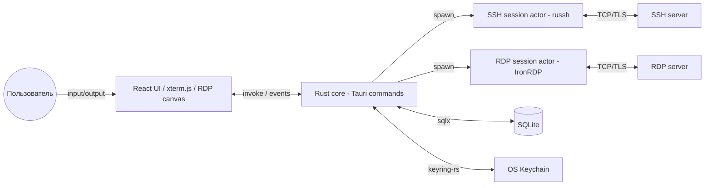
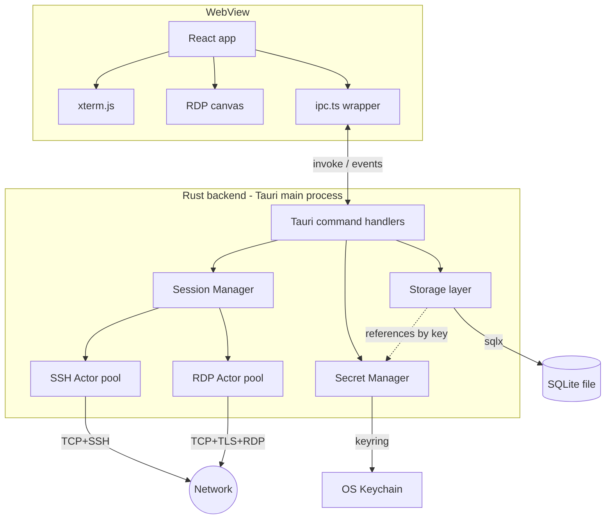
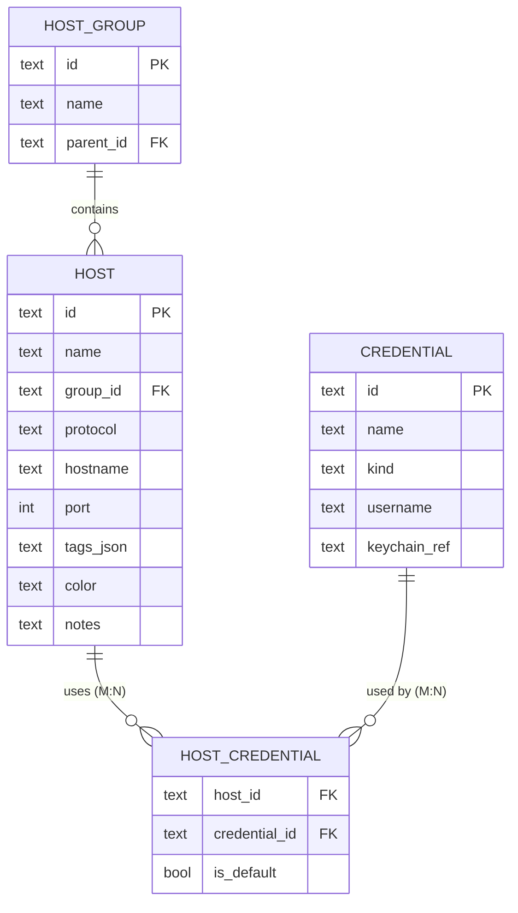
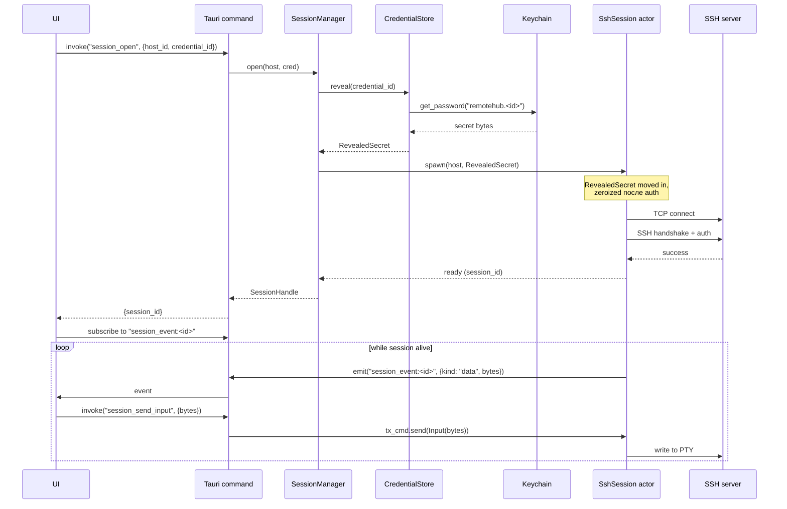

# System Overview — RemoteHub

## Overview

RemoteHub — desktop-приложение для удалённого подключения к серверам и рабочим станциям по SSH и RDP. Пользователь ведёт список хостов с метаданными и credentials, открывает к ним сессии в табах одного окна, работает с терминалом (SSH) или удалённым рабочим столом (RDP). Секреты (пароли, приватные ключи) лежат в OS keychain, а не в БД приложения. Приложение полностью локальное, без обязательного backend'а.

## Context



Приложение единое (Tauri даёт один процесс с двумя «половинами»: Rust backend и WebView с UI). Все сетевые операции — внутри Rust-половины. UI занимается только рендером и пользовательским вводом.

## Requirements

### Functional

1. CRUD хостов: имя, hostname/IP, порт, протокол (SSH/RDP), теги, группа/папка, цвет, заметки.
2. CRUD credentials: ассоциация с хостом, тип (password, ssh-key, certificate), значения в keychain.
3. Открытие SSH-сессии в новой вкладке: интерактивный PTY, рендер в xterm.js, ресайз, копировать/вставить, отключение.
4. Открытие RDP-сессии в новой вкладке: рендер frame'ов в canvas, мышь+клавиатура, ресайз, базовый clipboard (text), отключение.
5. Несколько одновременных сессий в разных вкладках; переключение между ними без потери состояния.
6. Поиск/фильтрация хостов по имени, тегу, группе.
7. Импорт/экспорт списка хостов в JSON (без секретов).
8. Темизация: light / dark / system.
9. Настройки: шрифт терминала, размер, цветовая схема, поведение скролла.

### Non-Functional

- **Latency**: SSH keystroke→remote echo overhead, добавленный приложением (без сети), ≤ 5 мс на современной машине.
- **RDP framerate**: ≥ 30 FPS на разрешении 1920×1080, 24bpp, при условии что сервер выдаёт.
- **Memory**: idle (без открытых сессий) ≤ 200 MB. Одна SSH-сессия — ≤ 20 MB overhead. Одна RDP-сессия 1080p — ≤ 100 MB.
- **Cold start**: ≤ 2 секунды до интерактивного UI на NVMe-диске.
- **Security**: секреты никогда не пишутся в файлы приложения (только в OS keychain); никогда не логируются; буферы с секретами очищаются после использования (`zeroize`).
- **Reliability**: падение одной сессии (panic в session actor, network error) не влияет на остальные и не валит приложение.

## Design

### Architecture



#### Crate boundaries

- **rh-core**: domain типы (`Host`, `Credential`, `SessionId`, …), trait'ы (`CredentialStore`, `HostStore`), error enums. Никакого I/O. Используется всеми остальными crate'ами.
- **rh-storage**: реализация `HostStore` поверх SQLite (sqlx), реализация `CredentialStore` поверх keyring-rs. Миграции схемы (на альфе — `DROP/CREATE` всё одной транзакцией при бампе версии).
- **rh-ssh**: актор `SshSession`, обёртка над russh-клиентом. Экспортирует тонкую публичную поверхность: `connect(...) -> SshSessionHandle`, плюс командные/событийные каналы.
- **rh-rdp**: аналог для RDP. Актор `RdpSession`, обёртка над IronRDP. Производит frame-события для UI.
- **rh-app**: bin-crate. Содержит Tauri command handlers, инициализацию tracing, конфигурацию, Session Manager. Зависит от всех остальных.

Никакая crate не зависит «снизу вверх»: `rh-ssh` не знает про Tauri или sqlx; `rh-storage` не знает про сессии. Связывает всё `rh-app`.

### Data Model

Подробно — в `docs/specs/data-model.md`. Здесь — суть.

Три домена данных:

1. **Hosts**, **Credentials**, **HostGroups** — структурированные, в SQLite. Credentials в БД хранят только метаданные (тип, ссылку на keychain-entry); сами значения — в keychain.
2. **Settings** — key/value (JSON-blob или плоский KV) в SQLite.
3. **Secrets** — в OS keychain. Идентифицируются составным ключом `remotehub.<credential_id>`.

Сессии — НЕ данные. Они существуют только в RAM, пока актор жив.



Credentials отделены от hosts через M:N: один SSH-ключ может использоваться для многих серверов, и один сервер может иметь несколько credentials (например, пароль + ключ для разных пользователей).

### Interfaces

Core контракты, на которые опирается всё остальное. Полные определения — в `data-model.md` и `session-protocol.md`. Здесь — выжимка.

```rust
// rh-core/src/types.rs

use serde::{Deserialize, Serialize};

#[derive(Debug, Clone, Serialize, Deserialize)]
pub struct Host {
    pub id: HostId,
    pub name: String,
    pub group_id: Option<GroupId>,
    pub protocol: Protocol,
    pub hostname: String,
    pub port: u16,
    pub tags: Vec<String>,
    pub color: Option<String>,
    pub notes: Option<String>,
    pub default_credential_id: Option<CredentialId>,
    pub created_at: chrono::DateTime<chrono::Utc>,
    pub updated_at: chrono::DateTime<chrono::Utc>,
}

#[derive(Debug, Clone, Copy, Serialize, Deserialize, PartialEq, Eq)]
#[serde(rename_all = "lowercase")]
pub enum Protocol {
    Ssh,
    Rdp,
}

#[derive(Debug, Clone, Serialize, Deserialize)]
pub struct Credential {
    pub id: CredentialId,
    pub name: String,
    pub kind: CredentialKind,
    pub username: String,
    pub keychain_ref: KeychainRef,
    pub created_at: chrono::DateTime<chrono::Utc>,
}

#[derive(Debug, Clone, Copy, Serialize, Deserialize, PartialEq, Eq)]
#[serde(rename_all = "snake_case")]
pub enum CredentialKind {
    Password,
    SshKey,         // PEM-encoded private key
    SshKeyAgent,    // forwarded from SSH agent
}

// Newtype-обёртки. Никаких String везде.
#[derive(Debug, Clone, Serialize, Deserialize, PartialEq, Eq, Hash)]
pub struct HostId(pub String);

#[derive(Debug, Clone, Serialize, Deserialize, PartialEq, Eq, Hash)]
pub struct CredentialId(pub String);

#[derive(Debug, Clone, Serialize, Deserialize, PartialEq, Eq, Hash)]
pub struct GroupId(pub String);

#[derive(Debug, Clone, Serialize, Deserialize, PartialEq, Eq, Hash)]
pub struct SessionId(pub String);

/// Непрозрачная ссылка на запись в keychain.
/// Никогда не содержит сам секрет.
#[derive(Debug, Clone, Serialize, Deserialize, PartialEq, Eq)]
pub struct KeychainRef(pub String);
```

```rust
// rh-core/src/error.rs

use thiserror::Error;

#[derive(Debug, Error)]
pub enum CoreError {
    #[error("host not found: {0:?}")]
    HostNotFound(HostId),

    #[error("credential not found: {0:?}")]
    CredentialNotFound(CredentialId),

    #[error("storage error: {0}")]
    Storage(#[from] StorageError),

    #[error("secret store error: {0}")]
    Secret(#[from] SecretError),

    #[error("session error: {0}")]
    Session(#[from] SessionError),

    #[error("validation error: {field}: {reason}")]
    Validation { field: &'static str, reason: String },
}
```

```rust
// rh-core/src/store.rs

use async_trait::async_trait;

#[async_trait]
pub trait HostStore: Send + Sync {
    async fn create(&self, host: &Host) -> Result<(), StorageError>;
    async fn get(&self, id: &HostId) -> Result<Host, StorageError>;
    async fn list(&self, filter: HostFilter) -> Result<Vec<Host>, StorageError>;
    async fn update(&self, host: &Host) -> Result<(), StorageError>;
    async fn delete(&self, id: &HostId) -> Result<(), StorageError>;
}

#[async_trait]
pub trait CredentialStore: Send + Sync {
    async fn create(&self, cred: &Credential, secret: SecretValue) -> Result<(), StorageError>;
    async fn get(&self, id: &CredentialId) -> Result<Credential, StorageError>;
    async fn list(&self) -> Result<Vec<Credential>, StorageError>;
    async fn delete(&self, id: &CredentialId) -> Result<(), StorageError>;

    /// Достаёт secret из keychain. Возвращает Zeroizing-wrapped значение.
    async fn reveal(&self, id: &CredentialId) -> Result<RevealedSecret, StorageError>;
}

/// Значение, которое будет записано в keychain.
/// Wrapped в Zeroizing — память очищается на drop.
pub struct SecretValue(pub Zeroizing<Vec<u8>>);

/// Secret извлечённый из keychain, для use в session.
/// Никогда не сериализуется, не клонируется без необходимости, не логируется.
pub struct RevealedSecret(pub Zeroizing<Vec<u8>>);
```

Контракты сессий (актор-модель) описаны отдельно в `session-protocol.md`. В двух словах: каждая сессия — это handle вида:

```rust
pub struct SessionHandle {
    pub id: SessionId,
    /// Канал команд от UI к сессии.
    pub tx_cmd: mpsc::Sender<SessionCommand>,
    /// Канал событий от сессии к UI.
    pub rx_evt: broadcast::Receiver<SessionEvent>,
    /// Завершение всей задачи. Drop этого = graceful shutdown.
    pub abort: AbortHandle,
}
```

### Key Flows

#### Flow 1: Открытие SSH-сессии



Ключевые моменты:
- `RevealedSecret` живёт от `reveal()` до окончания auth, после чего явно `zeroize`-нится. Никогда не пересекает Tauri-IPC.
- Каждая сессия — отдельная Tokio task. Если она паникует — это локализованная авария, не сваливает Session Manager.
- UI подписывается на конкретный event-channel по `session_id`, чтобы не получать события чужих вкладок.

#### Flow 2: Открытие RDP-сессии

Идентичная скелетная структура, но события `kind: "frame"` несут не байты, а ссылку на shared-buffer с pixel-data (избегаем копирования через JSON). Подробности — в `session-protocol.md` секция RDP.

#### Flow 3: Создание credential

```mermaid
sequenceDiagram
    participant U as UI
    participant T as Tauri command
    participant CS as CredentialStore (rh-storage)
    participant DB as SQLite
    participant KC as Keychain

    U->>T: invoke("credential_save", {name, kind, username, secret})
    Note over T: SecretValue приходит из UI как<br/>base64-encoded в IPC; распаковка → Zeroizing
    T->>CS: create(cred, secret)
    CS->>KC: set_password("remotehub.<new_id>", bytes)
    KC-->>CS: ok
    CS->>DB: INSERT INTO credentials (id, ..., keychain_ref)
    DB-->>CS: ok
    CS-->>T: ok
    T-->>U: {credential_id}
    Note over T,U: secret bytes уже zeroized в Rust-памяти.<br/>В UI-памяти — ответственность UI<br/>(closing modal должно очистить input).
```

Запись в keychain — **до** записи в БД. Если БД упадёт — у нас будет orphan-entry в keychain (видимо в системном UI keychain'а). Это терпимо: пользователь может удалить вручную, plus периодический cleanup job на старте. Обратное (БД первая, keychain второй) — хуже: orphan-запись в БД, ведущая в никуда, ломает session_open.

### Error Handling

| Failure mode | Detection | Reaction |
|---|---|---|
| SQLite файл повреждён / нет доступа | sqlx error при старте | UI показывает диалог: «БД недоступна, открыть в read-only / выбрать другой путь / выйти» |
| Keychain недоступен (Win Credential Manager отключён) | keyring error | UI показывает баннер: «Secret storage unavailable. Существующие credentials не могут быть прочитаны». Создание новых credentials блокируется. |
| Сетевая ошибка SSH (refused, timeout, DNS) | russh error | Session actor отправляет `SessionEvent::Error{...}` и завершается. UI показывает в табе error-state с retry-кнопкой. Остальные сессии не затронуты. |
| Сетевая ошибка RDP | ironrdp error | Аналогично SSH. |
| Auth failure | russh / ironrdp возвращают specific error | Session actor завершается. UI предлагает другие credentials для этого host'а. |
| Panic в session actor | `tokio::task::JoinHandle` возвращает `JoinError::Panic` | Session Manager логирует с full backtrace, отправляет в UI `SessionEvent::Crashed`, очищает свой реестр. |
| UI отключился от event-channel (закрытый таб без `session_close`) | broadcast lag detection | Session Manager шлёт идемпотентный `session_close` через timeout (30s no subscribers). |
| Tauri main процесс падает | OS report | Все сессии гибнут вместе с процессом. На старте — recovery: показать «прошлая сессия упала, открыть report?». В MVP — пустой start screen. |

### Concurrency model

- Один `tokio` runtime, multi-thread (default flavor для Tauri 2).
- `SessionManager` — `Arc<Mutex<HashMap<SessionId, SessionHandle>>>`. Мьютекс держится только на время поиска/вставки/удаления, не на время работы с сессией.
- Каждая сессия — `tokio::spawn`-нутая long-running task. Внутри неё — `tokio::select!` на (a) команды из mpsc, (b) данные с сети, (c) shutdown-сигнал.
- События наружу — через `tokio::sync::broadcast` (множественные подписчики на одну сессию допустимы — например, два UI-окна, хотя в MVP только одно).

## Security Considerations

### Secret handling

- Секреты (пароли, приватные ключи, encryption passphrases) **никогда** не пишутся на диск приложением. Только в OS keychain через `keyring-rs`.
- В Rust-памяти секреты живут в `Zeroizing<Vec<u8>>` или `Zeroizing<String>`. Drop = `zeroize()` = memset(0).
- Типы, владеющие секретами, не имплементируют `Debug` (или имплементируют как `"<redacted>"`). `Clone` — только осознанно.
- Логирование секретов — преступление. Любой `tracing::debug!` поле, потенциально содержащее секрет, должно явно `.skip()` его через `tracing::field::Empty` или substitute mask.

### TLS / SSH host verification

- **SSH**: `known_hosts`-файл рядом с БД приложения (`~/.remotehub/known_hosts`, формат OpenSSH-совместимый). На первое подключение — fingerprint-prompt в UI (TOFU). На mismatch — жёсткий блок с предупреждением. Никакого silent `accept-any`.
- **RDP**: проверка cert chain через нативный crypto (`rustls` + system roots через `rustls-native-certs`). Self-signed cert — prompt с fingerprint, аналогично SSH. Сохраняется в локальном trust store.

### Tauri capability model

Tauri 2 имеет ACL для команд. Минимум прав:
- WebView не имеет доступа к `fs`, `shell`, `http` API.
- Доступны только наши кастомные команды (`session_*`, `host_*`, `credential_*`, `settings_*`).
- CSP: `default-src 'self'; connect-src 'self' ipc:; img-src 'self' data: blob:`. Без `unsafe-inline`, без CDN.

### Input validation

- Hostname/port валидируются на уровне Tauri command handler перед передачей в session actor. Невалидное → возврат `CoreError::Validation` до спавна актора.
- Имена credentials/hosts/groups имеют max length (256 chars) и проверяются на NUL-байты.
- Импорт JSON — строгая schema validation. Лишние поля игнорируются молча, отсутствующие обязательные — error.

### Logging

- В prod build — INFO level в JSON-файл в platform-specific log dir (`%APPDATA%/RemoteHub/logs/` на Windows).
- В dev build — DEBUG level + stderr.
- TRACE — только в debug-сборке и под env флагом.
- Ротация — daily, max 7 файлов.
- Никаких credentials, никаких payload session-данных в логах. Только session_id, hostname, timing.

## Observability

Для MVP — минимум:

- **Logs**: tracing, см. выше. Достаточно для разбора инцидента.
- **Metrics**: не выставляем наружу (приложение не серверное), но внутренние счётчики собираем через `tracing::Span` для будущей телеметрии:
  - Sessions opened / closed (by protocol)
  - Auth failures (by protocol, без деталей)
  - Average session duration
  - Crashes (panics) per session
- **Crash reports**: на старте проверяем sentinel-файл предыдущей сессии. Если он остался — значит был аварийный exit; предложить пользователю отправить лог (на дев-стадии — просто показать путь). Внешний crash reporter (Sentry и т.п.) — после MVP.

## Open Questions

1. **RDP frame transport между Rust и UI.** Tauri custom protocol (`stream://`) vs. emit чанками base64 vs. shared memory. Все три работают; различаются производительностью на full-screen 60Hz. **Предложение для спеки**: на MVP — emit с binary payload (Tauri 2 поддерживает `Channel<Vec<u8>>` без base64). Если в реальном тесте окажется bottleneck — переходим на custom protocol. Решение зафиксируем в `session-protocol.md` после быстрого spike'а на этапе RDP foundation.
2. **Структура `tags`**: храним как JSON-массив в одной колонке Host'а, или отдельная таблица `tags` + `host_tags`? **Предложение**: на альфе — JSON-массив (проще, быстрее, indexed search не нужен на 100-1000 хостах). Если когда-то понадобится тег-аналитика (cloud edition) — мигрируем.
3. **Импорт из других клиентов** (Termius, MobaXterm, PuTTY): включаем в MVP или нет? **Предложение**: НЕТ в MVP, добавим после первого публичного релиза. Свой JSON-формат достаточен для bootstrap'а power-users.
4. **SSH config-файл (`~/.ssh/config`) как источник хостов**: парсить или игнорировать? **Предложение**: НЕТ в MVP. Двусторонняя синхронизация — отдельный проект.
5. **Multi-window**: один или несколько окон приложения? **Предложение**: одно окно, табы внутри. Multi-window — после MVP.

## Assumptions

- Пользователь — единственный на устройстве; multi-user-режим внутри одного приложения (как в Termius Pro) не нужен.
- Сеть прямая; прокси (SOCKS5, jump host) — после MVP. SSH ProxyJump поддерживается на уровне russh-config, но UI его не выставляет.
- Шифрование локальной БД (SQLite encryption через SQLCipher) — НЕ нужно в MVP. Все секреты и так в keychain; БД содержит только метаданные. Если пользователь явно захочет шифрование БД — отдельная итерация.
- Поддерживаемые версии Windows: 10 22H2+, 11. macOS — после MVP, но архитектурно работаем (Tauri и все crate'ы кроссплатформенны).
- Целевой пользователь — техничный (devops, sysadmin, developer). UI оптимизирован под клавиатуру и продуктивность, не под «mass market».

## Related specs

- `data-model.md` — детальная схема SQLite и keychain naming.
- `tauri-api.md` — полный список команд UI ↔ Rust и их сигнатуры.
- `session-protocol.md` — actor-модель сессий, message types, error flows.
- `ssh-session.md` — детали интеграции russh.
- `rdp-session.md` — детали интеграции IronRDP.
- `docs/specs/plans/01-foundation.md` — первый имплементационный план.
